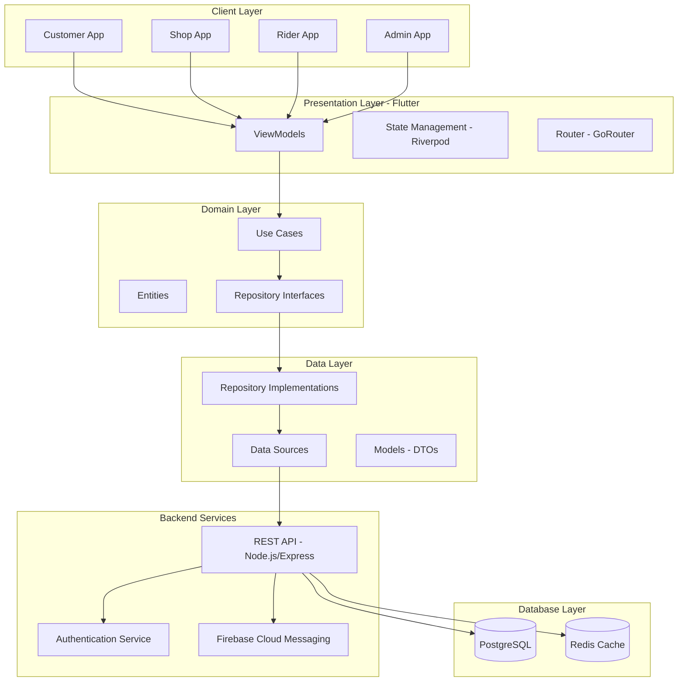
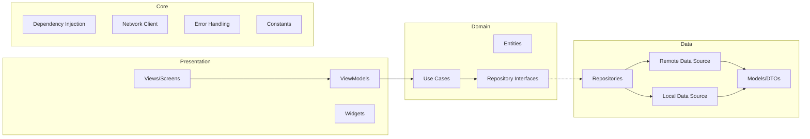
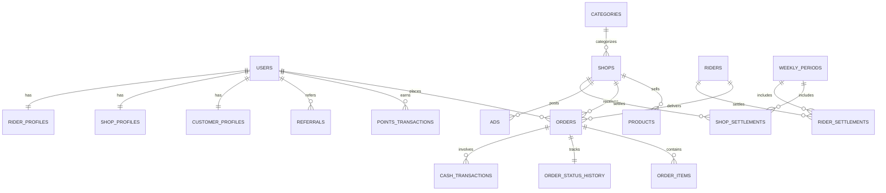
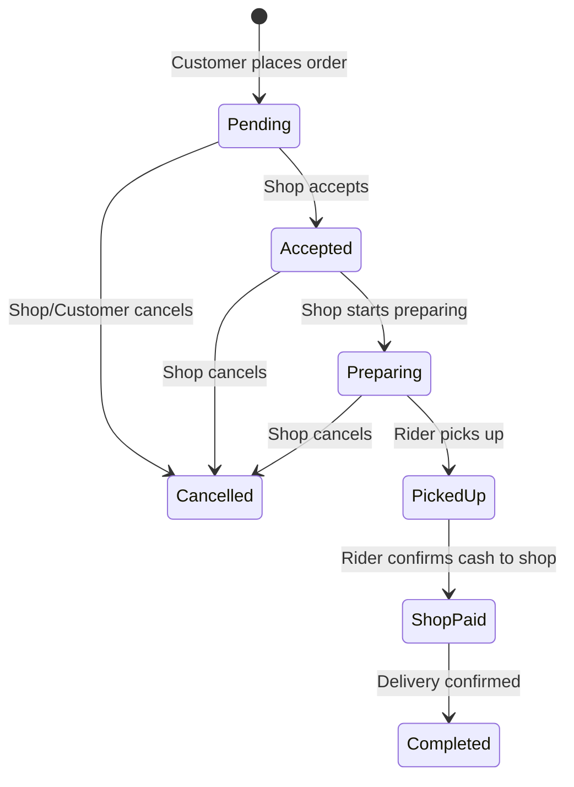
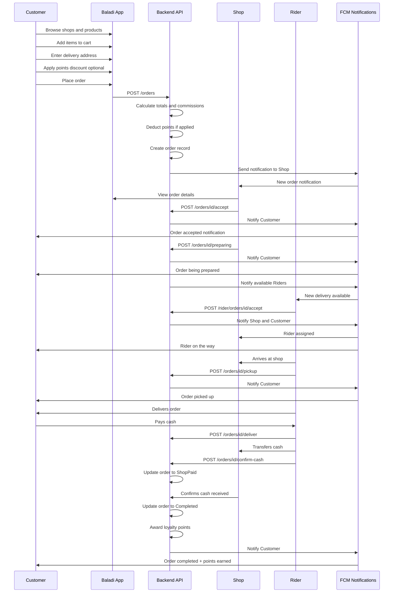
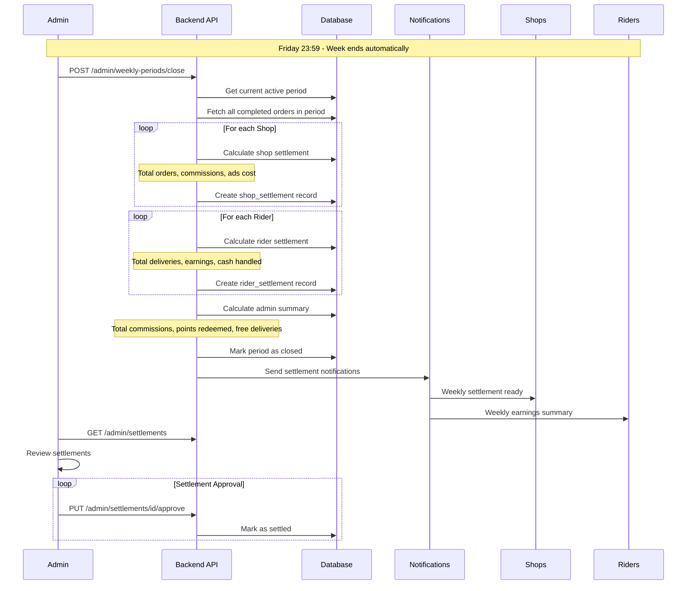

# Baladi - Multi-Role Delivery Application Architecture

## Executive Summary

Baladi is a sophisticated multi-role mobile application designed for daily needs delivery in small communities. The app serves four distinct user roles: Customer, Shop, Delivery Rider, and Admin, with comprehensive features including order management, loyalty points, weekly settlements, and advertising capabilities.

---

## Table of Contents

1. [System Architecture Overview](#1-system-architecture-overview)
2. [Database Schema](#2-database-schema)
3. [API Endpoints](#3-api-endpoints)
4. [Order Lifecycle](#4-order-lifecycle)
5. [Weekly Settlement System](#5-weekly-settlement-system)
6. [Role-Based Features](#6-role-based-features)
7. [UI/UX Design System](#7-uiux-design-system)
8. [Flutter Project Structure](#8-flutter-project-structure)
9. [Security & Scalability](#9-security--scalability)
10. [Implementation Roadmap](#10-implementation-roadmap)

---

## 1. System Architecture Overview

### 1.1 High-Level Architecture Diagram



### 1.2 MVVM + Clean Architecture Layers



### 1.3 Technology Stack

| Layer | Technology | Purpose |
|-------|------------|---------|
| Frontend | Flutter 3.x | Cross-platform mobile development |
| State Management | Riverpod | Reactive state management |
| Navigation | GoRouter | Declarative routing |
| Local Storage | Hive/SharedPreferences | Offline data & preferences |
| Backend | Node.js + Express | REST API server |
| Database | PostgreSQL | Primary data storage |
| Cache | Redis | Session & query caching |
| Push Notifications | Firebase Cloud Messaging | Free push notifications |
| Authentication | JWT + PIN/Password | Role-based auth |

---

## 2. Database Schema

### 2.1 Entity Relationship Diagram



### 2.2 Detailed Table Schemas

#### 2.2.1 Users Table
```sql
CREATE TABLE users (
    id UUID PRIMARY KEY DEFAULT gen_random_uuid(),
    role ENUM('customer', 'shop', 'rider', 'admin') NOT NULL,
    phone_number VARCHAR(20) UNIQUE,
    username VARCHAR(50) UNIQUE,
    password_hash VARCHAR(255),
    pin_hash VARCHAR(255),
    security_answer_hash VARCHAR(255),
    is_active BOOLEAN DEFAULT true,
    created_at TIMESTAMP DEFAULT CURRENT_TIMESTAMP,
    updated_at TIMESTAMP DEFAULT CURRENT_TIMESTAMP,
    last_login_at TIMESTAMP,
    fcm_token VARCHAR(255),
    
    CONSTRAINT chk_auth CHECK (
        (role = 'customer' AND phone_number IS NOT NULL AND pin_hash IS NOT NULL) OR
        (role IN ('shop', 'rider', 'admin') AND username IS NOT NULL AND password_hash IS NOT NULL)
    )
);

CREATE INDEX idx_users_role ON users(role);
CREATE INDEX idx_users_phone ON users(phone_number);
CREATE INDEX idx_users_username ON users(username);
```

#### 2.2.2 Customer Profiles Table
```sql
CREATE TABLE customer_profiles (
    id UUID PRIMARY KEY DEFAULT gen_random_uuid(),
    user_id UUID UNIQUE REFERENCES users(id) ON DELETE CASCADE,
    full_name VARCHAR(100) NOT NULL,
    address_line1 VARCHAR(255),
    address_line2 VARCHAR(255),
    landmark VARCHAR(255),
    area VARCHAR(100),
    latitude DECIMAL(10, 8),
    longitude DECIMAL(11, 8),
    total_points INTEGER DEFAULT 0,
    redeemed_points INTEGER DEFAULT 0,
    referral_code VARCHAR(20) UNIQUE,
    referred_by UUID REFERENCES customer_profiles(id),
    created_at TIMESTAMP DEFAULT CURRENT_TIMESTAMP,
    updated_at TIMESTAMP DEFAULT CURRENT_TIMESTAMP
);

CREATE INDEX idx_customer_referral ON customer_profiles(referral_code);
CREATE INDEX idx_customer_points ON customer_profiles(total_points);
```

#### 2.2.3 Shops Table
```sql
CREATE TABLE shops (
    id UUID PRIMARY KEY DEFAULT gen_random_uuid(),
    user_id UUID UNIQUE REFERENCES users(id) ON DELETE CASCADE,
    name VARCHAR(100) NOT NULL,
    name_ar VARCHAR(100),
    description TEXT,
    category_id UUID REFERENCES categories(id),
    logo_url VARCHAR(500),
    cover_image_url VARCHAR(500),
    phone VARCHAR(20),
    address VARCHAR(255),
    latitude DECIMAL(10, 8),
    longitude DECIMAL(11, 8),
    commission_rate DECIMAL(5, 2) DEFAULT 10.00,
    is_open BOOLEAN DEFAULT true,
    opening_time TIME,
    closing_time TIME,
    min_order_amount DECIMAL(10, 2) DEFAULT 0,
    avg_preparation_time INTEGER DEFAULT 30,
    rating DECIMAL(3, 2) DEFAULT 0,
    total_orders INTEGER DEFAULT 0,
    created_at TIMESTAMP DEFAULT CURRENT_TIMESTAMP,
    updated_at TIMESTAMP DEFAULT CURRENT_TIMESTAMP
);

CREATE INDEX idx_shops_category ON shops(category_id);
CREATE INDEX idx_shops_active ON shops(is_open, is_active);
```

#### 2.2.4 Riders Table
```sql
CREATE TABLE riders (
    id UUID PRIMARY KEY DEFAULT gen_random_uuid(),
    user_id UUID UNIQUE REFERENCES users(id) ON DELETE CASCADE,
    full_name VARCHAR(100) NOT NULL,
    phone VARCHAR(20) NOT NULL,
    national_id VARCHAR(20),
    vehicle_type ENUM('bicycle', 'motorcycle', 'car') DEFAULT 'motorcycle',
    vehicle_plate VARCHAR(20),
    is_available BOOLEAN DEFAULT false,
    is_online BOOLEAN DEFAULT false,
    current_latitude DECIMAL(10, 8),
    current_longitude DECIMAL(11, 8),
    delivery_fee DECIMAL(10, 2) DEFAULT 10.00,
    commission_rate DECIMAL(5, 2) DEFAULT 0,
    rating DECIMAL(3, 2) DEFAULT 0,
    total_deliveries INTEGER DEFAULT 0,
    created_at TIMESTAMP DEFAULT CURRENT_TIMESTAMP,
    updated_at TIMESTAMP DEFAULT CURRENT_TIMESTAMP
);

CREATE INDEX idx_riders_available ON riders(is_available, is_online);
CREATE INDEX idx_riders_location ON riders(current_latitude, current_longitude);
```

#### 2.2.5 Categories Table
```sql
CREATE TABLE categories (
    id UUID PRIMARY KEY DEFAULT gen_random_uuid(),
    name VARCHAR(50) NOT NULL,
    name_ar VARCHAR(50),
    slug VARCHAR(50) UNIQUE NOT NULL,
    icon_url VARCHAR(500),
    color_hex VARCHAR(7),
    sort_order INTEGER DEFAULT 0,
    is_active BOOLEAN DEFAULT true,
    created_at TIMESTAMP DEFAULT CURRENT_TIMESTAMP
);

-- Seed data
INSERT INTO categories (name, name_ar, slug, color_hex, sort_order) VALUES
('Restaurants', 'مطاعم', 'restaurants', '#FF6B35', 1),
('Bakeries', 'مخابز', 'bakeries', '#F7C59F', 2),
('Pharmacies', 'صيدليات', 'pharmacies', '#2EC4B6', 3),
('Cosmetics', 'مستحضرات تجميل', 'cosmetics', '#E71D73', 4),
('Daily Habit', 'احتياجات يومية', 'daily-habit', '#7B2CBF', 5);
```

#### 2.2.6 Products Table
```sql
CREATE TABLE products (
    id UUID PRIMARY KEY DEFAULT gen_random_uuid(),
    shop_id UUID REFERENCES shops(id) ON DELETE CASCADE,
    name VARCHAR(100) NOT NULL,
    name_ar VARCHAR(100),
    description TEXT,
    price DECIMAL(10, 2) NOT NULL,
    discount_price DECIMAL(10, 2),
    image_url VARCHAR(500),
    category VARCHAR(50),
    is_available BOOLEAN DEFAULT true,
    preparation_time INTEGER,
    sort_order INTEGER DEFAULT 0,
    created_at TIMESTAMP DEFAULT CURRENT_TIMESTAMP,
    updated_at TIMESTAMP DEFAULT CURRENT_TIMESTAMP
);

CREATE INDEX idx_products_shop ON products(shop_id, is_available);
CREATE INDEX idx_products_price ON products(price);
```

#### 2.2.7 Orders Table
```sql
CREATE TABLE orders (
    id UUID PRIMARY KEY DEFAULT gen_random_uuid(),
    order_number VARCHAR(20) UNIQUE NOT NULL,
    customer_id UUID REFERENCES customer_profiles(id),
    shop_id UUID REFERENCES shops(id),
    rider_id UUID REFERENCES riders(id),
    
    -- Status tracking
    status ENUM('pending', 'accepted', 'preparing', 'picked_up', 'shop_paid', 'completed', 'cancelled') DEFAULT 'pending',
    
    -- Delivery address snapshot
    delivery_address_line1 VARCHAR(255),
    delivery_address_line2 VARCHAR(255),
    delivery_landmark VARCHAR(255),
    delivery_area VARCHAR(100),
    delivery_latitude DECIMAL(10, 8),
    delivery_longitude DECIMAL(11, 8),
    
    -- Financials
    subtotal DECIMAL(10, 2) NOT NULL,
    delivery_fee DECIMAL(10, 2) DEFAULT 0,
    is_free_delivery BOOLEAN DEFAULT false,
    points_redeemed INTEGER DEFAULT 0,
    points_discount DECIMAL(10, 2) DEFAULT 0,
    total_amount DECIMAL(10, 2) NOT NULL,
    
    -- Commission calculations
    shop_commission_rate DECIMAL(5, 2),
    shop_commission_amount DECIMAL(10, 2),
    admin_commission_amount DECIMAL(10, 2),
    rider_earnings DECIMAL(10, 2),
    
    -- Points earned
    points_earned INTEGER DEFAULT 0,
    
    -- Weekly period reference
    weekly_period_id UUID REFERENCES weekly_periods(id),
    
    -- Cash handling
    cash_collected_by_rider BOOLEAN DEFAULT false,
    cash_transferred_to_shop BOOLEAN DEFAULT false,
    
    -- Notes
    customer_notes TEXT,
    shop_notes TEXT,
    cancellation_reason TEXT,
    
    -- Timestamps
    created_at TIMESTAMP DEFAULT CURRENT_TIMESTAMP,
    accepted_at TIMESTAMP,
    preparing_at TIMESTAMP,
    picked_up_at TIMESTAMP,
    shop_paid_at TIMESTAMP,
    completed_at TIMESTAMP,
    cancelled_at TIMESTAMP
);

CREATE INDEX idx_orders_customer ON orders(customer_id, created_at DESC);
CREATE INDEX idx_orders_shop ON orders(shop_id, created_at DESC);
CREATE INDEX idx_orders_rider ON orders(rider_id, created_at DESC);
CREATE INDEX idx_orders_status ON orders(status);
CREATE INDEX idx_orders_period ON orders(weekly_period_id);
CREATE INDEX idx_orders_number ON orders(order_number);
```

#### 2.2.8 Order Items Table
```sql
CREATE TABLE order_items (
    id UUID PRIMARY KEY DEFAULT gen_random_uuid(),
    order_id UUID REFERENCES orders(id) ON DELETE CASCADE,
    product_id UUID REFERENCES products(id),
    product_name VARCHAR(100) NOT NULL,
    product_price DECIMAL(10, 2) NOT NULL,
    quantity INTEGER NOT NULL DEFAULT 1,
    subtotal DECIMAL(10, 2) NOT NULL,
    notes TEXT,
    created_at TIMESTAMP DEFAULT CURRENT_TIMESTAMP
);

CREATE INDEX idx_order_items_order ON order_items(order_id);
```

#### 2.2.9 Order Status History Table
```sql
CREATE TABLE order_status_history (
    id UUID PRIMARY KEY DEFAULT gen_random_uuid(),
    order_id UUID REFERENCES orders(id) ON DELETE CASCADE,
    status VARCHAR(50) NOT NULL,
    changed_by UUID REFERENCES users(id),
    notes TEXT,
    created_at TIMESTAMP DEFAULT CURRENT_TIMESTAMP
);

CREATE INDEX idx_status_history_order ON order_status_history(order_id, created_at);
```

#### 2.2.10 Points Transactions Table
```sql
CREATE TABLE points_transactions (
    id UUID PRIMARY KEY DEFAULT gen_random_uuid(),
    customer_id UUID REFERENCES customer_profiles(id),
    order_id UUID REFERENCES orders(id),
    type ENUM('earned', 'redeemed', 'referral_bonus', 'admin_adjustment') NOT NULL,
    points INTEGER NOT NULL,
    balance_after INTEGER NOT NULL,
    description TEXT,
    created_at TIMESTAMP DEFAULT CURRENT_TIMESTAMP
);

CREATE INDEX idx_points_customer ON points_transactions(customer_id, created_at DESC);
CREATE INDEX idx_points_type ON points_transactions(type);
```

#### 2.2.11 Referrals Table
```sql
CREATE TABLE referrals (
    id UUID PRIMARY KEY DEFAULT gen_random_uuid(),
    referrer_id UUID REFERENCES customer_profiles(id),
    referred_id UUID REFERENCES customer_profiles(id),
    referral_code VARCHAR(20) NOT NULL,
    first_order_id UUID REFERENCES orders(id),
    points_awarded INTEGER DEFAULT 0,
    status ENUM('pending', 'completed', 'expired') DEFAULT 'pending',
    created_at TIMESTAMP DEFAULT CURRENT_TIMESTAMP,
    completed_at TIMESTAMP
);

CREATE INDEX idx_referrals_referrer ON referrals(referrer_id);
CREATE INDEX idx_referrals_status ON referrals(status);
```

#### 2.2.12 Weekly Periods Table
```sql
CREATE TABLE weekly_periods (
    id UUID PRIMARY KEY DEFAULT gen_random_uuid(),
    period_number INTEGER NOT NULL,
    year INTEGER NOT NULL,
    start_date DATE NOT NULL,
    end_date DATE NOT NULL,
    start_datetime TIMESTAMP NOT NULL,
    end_datetime TIMESTAMP NOT NULL,
    status ENUM('active', 'closed', 'settled') DEFAULT 'active',
    closed_by UUID REFERENCES users(id),
    closed_at TIMESTAMP,
    notes TEXT,
    created_at TIMESTAMP DEFAULT CURRENT_TIMESTAMP,
    
    UNIQUE(year, period_number)
);

CREATE INDEX idx_periods_status ON weekly_periods(status);
CREATE INDEX idx_periods_dates ON weekly_periods(start_date, end_date);
```

#### 2.2.13 Shop Settlements Table
```sql
CREATE TABLE shop_settlements (
    id UUID PRIMARY KEY DEFAULT gen_random_uuid(),
    shop_id UUID REFERENCES shops(id),
    weekly_period_id UUID REFERENCES weekly_periods(id),
    
    -- Order summary
    total_orders INTEGER DEFAULT 0,
    completed_orders INTEGER DEFAULT 0,
    cancelled_orders INTEGER DEFAULT 0,
    
    -- Financial summary
    gross_sales DECIMAL(12, 2) DEFAULT 0,
    total_commission DECIMAL(12, 2) DEFAULT 0,
    points_discounts_given DECIMAL(12, 2) DEFAULT 0,
    free_delivery_costs DECIMAL(12, 2) DEFAULT 0,
    ads_cost DECIMAL(12, 2) DEFAULT 0,
    net_payable DECIMAL(12, 2) DEFAULT 0,
    
    -- Settlement status
    status ENUM('pending', 'reviewed', 'settled', 'disputed') DEFAULT 'pending',
    settled_at TIMESTAMP,
    settled_by UUID REFERENCES users(id),
    notes TEXT,
    
    created_at TIMESTAMP DEFAULT CURRENT_TIMESTAMP,
    updated_at TIMESTAMP DEFAULT CURRENT_TIMESTAMP,
    
    UNIQUE(shop_id, weekly_period_id)
);

CREATE INDEX idx_shop_settlements_period ON shop_settlements(weekly_period_id);
CREATE INDEX idx_shop_settlements_status ON shop_settlements(status);
```

#### 2.2.14 Rider Settlements Table
```sql
CREATE TABLE rider_settlements (
    id UUID PRIMARY KEY DEFAULT gen_random_uuid(),
    rider_id UUID REFERENCES riders(id),
    weekly_period_id UUID REFERENCES weekly_periods(id),
    
    -- Delivery summary
    total_deliveries INTEGER DEFAULT 0,
    completed_deliveries INTEGER DEFAULT 0,
    
    -- Financial summary
    total_delivery_fees DECIMAL(12, 2) DEFAULT 0,
    total_cash_collected DECIMAL(12, 2) DEFAULT 0,
    total_cash_transferred DECIMAL(12, 2) DEFAULT 0,
    commission_deducted DECIMAL(12, 2) DEFAULT 0,
    net_earnings DECIMAL(12, 2) DEFAULT 0,
    
    -- Settlement status
    status ENUM('pending', 'reviewed', 'settled', 'disputed') DEFAULT 'pending',
    settled_at TIMESTAMP,
    settled_by UUID REFERENCES users(id),
    notes TEXT,
    
    created_at TIMESTAMP DEFAULT CURRENT_TIMESTAMP,
    updated_at TIMESTAMP DEFAULT CURRENT_TIMESTAMP,
    
    UNIQUE(rider_id, weekly_period_id)
);

CREATE INDEX idx_rider_settlements_period ON rider_settlements(weekly_period_id);
CREATE INDEX idx_rider_settlements_status ON rider_settlements(status);
```

#### 2.2.15 Ads Table
```sql
CREATE TABLE ads (
    id UUID PRIMARY KEY DEFAULT gen_random_uuid(),
    shop_id UUID REFERENCES shops(id),
    title VARCHAR(100) NOT NULL,
    title_ar VARCHAR(100),
    description TEXT,
    image_url VARCHAR(500),
    ad_type ENUM('daily_offer', 'banner', 'featured') DEFAULT 'daily_offer',
    daily_cost DECIMAL(10, 2) DEFAULT 10.00,
    start_date DATE NOT NULL,
    end_date DATE NOT NULL,
    is_active BOOLEAN DEFAULT true,
    impressions INTEGER DEFAULT 0,
    clicks INTEGER DEFAULT 0,
    total_cost DECIMAL(10, 2) DEFAULT 0,
    weekly_period_id UUID REFERENCES weekly_periods(id),
    created_at TIMESTAMP DEFAULT CURRENT_TIMESTAMP,
    updated_at TIMESTAMP DEFAULT CURRENT_TIMESTAMP
);

CREATE INDEX idx_ads_shop ON ads(shop_id);
CREATE INDEX idx_ads_active ON ads(is_active, start_date, end_date);
CREATE INDEX idx_ads_period ON ads(weekly_period_id);
```

#### 2.2.16 Cash Transactions Table
```sql
CREATE TABLE cash_transactions (
    id UUID PRIMARY KEY DEFAULT gen_random_uuid(),
    order_id UUID REFERENCES orders(id),
    type ENUM('customer_to_rider', 'rider_to_shop', 'shop_to_admin') NOT NULL,
    amount DECIMAL(10, 2) NOT NULL,
    from_user_id UUID REFERENCES users(id),
    to_user_id UUID REFERENCES users(id),
    confirmed_at TIMESTAMP,
    confirmed_by UUID REFERENCES users(id),
    notes TEXT,
    created_at TIMESTAMP DEFAULT CURRENT_TIMESTAMP
);

CREATE INDEX idx_cash_order ON cash_transactions(order_id);
CREATE INDEX idx_cash_type ON cash_transactions(type);
```

#### 2.2.17 Notifications Table
```sql
CREATE TABLE notifications (
    id UUID PRIMARY KEY DEFAULT gen_random_uuid(),
    user_id UUID REFERENCES users(id),
    title VARCHAR(100) NOT NULL,
    body TEXT NOT NULL,
    type ENUM('order', 'points', 'settlement', 'ad', 'system') NOT NULL,
    data JSONB,
    is_read BOOLEAN DEFAULT false,
    sent_at TIMESTAMP,
    read_at TIMESTAMP,
    created_at TIMESTAMP DEFAULT CURRENT_TIMESTAMP
);

CREATE INDEX idx_notifications_user ON notifications(user_id, is_read, created_at DESC);
CREATE INDEX idx_notifications_type ON notifications(type);
```

#### 2.2.18 Audit Logs Table
```sql
CREATE TABLE audit_logs (
    id UUID PRIMARY KEY DEFAULT gen_random_uuid(),
    user_id UUID REFERENCES users(id),
    action VARCHAR(100) NOT NULL,
    entity_type VARCHAR(50) NOT NULL,
    entity_id UUID,
    old_values JSONB,
    new_values JSONB,
    ip_address VARCHAR(45),
    user_agent TEXT,
    created_at TIMESTAMP DEFAULT CURRENT_TIMESTAMP
);

CREATE INDEX idx_audit_user ON audit_logs(user_id, created_at DESC);
CREATE INDEX idx_audit_entity ON audit_logs(entity_type, entity_id);
CREATE INDEX idx_audit_action ON audit_logs(action);
```

---

## 3. API Endpoints

### 3.1 Authentication Endpoints

| Method | Endpoint | Description | Roles |
|--------|----------|-------------|-------|
| POST | `/api/v1/auth/customer/register` | Register customer with phone + PIN | Public |
| POST | `/api/v1/auth/customer/login` | Login with phone + PIN | Public |
| POST | `/api/v1/auth/customer/recover` | Recover PIN via security question | Public |
| POST | `/api/v1/auth/login` | Login for Shop/Rider/Admin | Public |
| POST | `/api/v1/auth/refresh` | Refresh JWT token | All |
| POST | `/api/v1/auth/logout` | Logout and invalidate token | All |
| PUT | `/api/v1/auth/fcm-token` | Update FCM token | All |

### 3.2 Customer Endpoints

| Method | Endpoint | Description |
|--------|----------|-------------|
| GET | `/api/v1/customer/profile` | Get customer profile |
| PUT | `/api/v1/customer/profile` | Update customer profile |
| PUT | `/api/v1/customer/address` | Update delivery address |
| GET | `/api/v1/customer/points` | Get points balance and history |
| GET | `/api/v1/customer/referral` | Get referral code and stats |
| POST | `/api/v1/customer/referral/apply` | Apply referral code |

### 3.3 Category & Shop Endpoints

| Method | Endpoint | Description |
|--------|----------|-------------|
| GET | `/api/v1/categories` | List all categories |
| GET | `/api/v1/categories/:slug/shops` | List shops in category |
| GET | `/api/v1/shops/:id` | Get shop details |
| GET | `/api/v1/shops/:id/products` | Get shop products |
| GET | `/api/v1/shops/:id/reviews` | Get shop reviews |

### 3.4 Order Endpoints

| Method | Endpoint | Description | Roles |
|--------|----------|-------------|-------|
| POST | `/api/v1/orders` | Create new order | Customer |
| GET | `/api/v1/orders` | List orders | All |
| GET | `/api/v1/orders/:id` | Get order details | All |
| PUT | `/api/v1/orders/:id/status` | Update order status | Shop, Rider |
| POST | `/api/v1/orders/:id/accept` | Accept order | Shop |
| POST | `/api/v1/orders/:id/preparing` | Mark as preparing | Shop |
| POST | `/api/v1/orders/:id/ready` | Mark as ready for pickup | Shop |
| POST | `/api/v1/orders/:id/pickup` | Rider picks up order | Rider |
| POST | `/api/v1/orders/:id/deliver` | Mark as delivered | Rider |
| POST | `/api/v1/orders/:id/confirm-cash` | Confirm cash received | Shop |
| POST | `/api/v1/orders/:id/cancel` | Cancel order | Customer, Shop, Admin |
| GET | `/api/v1/orders/:id/tracking` | Get order tracking | Customer |

### 3.5 Shop Management Endpoints

| Method | Endpoint | Description |
|--------|----------|-------------|
| GET | `/api/v1/shop/profile` | Get shop profile |
| PUT | `/api/v1/shop/profile` | Update shop profile |
| PUT | `/api/v1/shop/status` | Toggle open/closed |
| GET | `/api/v1/shop/products` | List shop products |
| POST | `/api/v1/shop/products` | Add product |
| PUT | `/api/v1/shop/products/:id` | Update product |
| DELETE | `/api/v1/shop/products/:id` | Delete product |
| GET | `/api/v1/shop/orders` | List shop orders |
| GET | `/api/v1/shop/dashboard` | Get dashboard metrics |
| GET | `/api/v1/shop/settlements` | List settlements |
| GET | `/api/v1/shop/settlements/:id` | Get settlement details |

### 3.6 Rider Endpoints

| Method | Endpoint | Description |
|--------|----------|-------------|
| GET | `/api/v1/rider/profile` | Get rider profile |
| PUT | `/api/v1/rider/profile` | Update rider profile |
| PUT | `/api/v1/rider/status` | Toggle online/offline |
| PUT | `/api/v1/rider/location` | Update current location |
| GET | `/api/v1/rider/orders/available` | List available orders |
| GET | `/api/v1/rider/orders` | List assigned orders |
| POST | `/api/v1/rider/orders/:id/accept` | Accept delivery |
| GET | `/api/v1/rider/dashboard` | Get dashboard metrics |
| GET | `/api/v1/rider/earnings` | Get earnings summary |
| GET | `/api/v1/rider/settlements` | List settlements |

### 3.7 Ads Endpoints

| Method | Endpoint | Description | Roles |
|--------|----------|-------------|-------|
| GET | `/api/v1/ads` | List active ads | Public |
| POST | `/api/v1/shop/ads` | Create ad | Shop |
| GET | `/api/v1/shop/ads` | List shop ads | Shop |
| PUT | `/api/v1/shop/ads/:id` | Update ad | Shop |
| DELETE | `/api/v1/shop/ads/:id` | Delete ad | Shop |
| POST | `/api/v1/ads/:id/impression` | Track impression | Public |
| POST | `/api/v1/ads/:id/click` | Track click | Public |

### 3.8 Admin Endpoints

| Method | Endpoint | Description |
|--------|----------|-------------|
| GET | `/api/v1/admin/dashboard` | Get admin dashboard |
| GET | `/api/v1/admin/users` | List all users |
| GET | `/api/v1/admin/users/:id` | Get user details |
| PUT | `/api/v1/admin/users/:id` | Update user |
| PUT | `/api/v1/admin/users/:id/status` | Activate/Deactivate user |
| POST | `/api/v1/admin/users/:id/reset-password` | Reset user password |
| GET | `/api/v1/admin/shops` | List all shops |
| PUT | `/api/v1/admin/shops/:id` | Update shop |
| GET | `/api/v1/admin/riders` | List all riders |
| PUT | `/api/v1/admin/riders/:id` | Update rider |
| GET | `/api/v1/admin/orders` | List all orders |
| GET | `/api/v1/admin/orders/:id` | Get order details |
| PUT | `/api/v1/admin/orders/:id/resolve` | Resolve dispute |
| GET | `/api/v1/admin/points` | Points management |
| POST | `/api/v1/admin/points/adjust` | Adjust user points |
| GET | `/api/v1/admin/weekly-periods` | List weekly periods |
| POST | `/api/v1/admin/weekly-periods/close` | Close current week |
| GET | `/api/v1/admin/settlements` | List all settlements |
| PUT | `/api/v1/admin/settlements/:id/approve` | Approve settlement |
| GET | `/api/v1/admin/ads` | List all ads |
| PUT | `/api/v1/admin/ads/:id` | Manage ad |
| GET | `/api/v1/admin/reports` | Generate reports |

### 3.9 Notification Endpoints

| Method | Endpoint | Description |
|--------|----------|-------------|
| GET | `/api/v1/notifications` | List notifications |
| PUT | `/api/v1/notifications/:id/read` | Mark as read |
| PUT | `/api/v1/notifications/read-all` | Mark all as read |
| DELETE | `/api/v1/notifications/:id` | Delete notification |

---

## 4. Order Lifecycle

### 4.1 Order Status Flow



### 4.2 Order Lifecycle Sequence Diagram



### 4.3 Points Calculation

```
Points Earned = floor(order_subtotal / 100)
Example: Order of 350 EGP = 3 points

Referral Bonus = 2 points (awarded when referred user completes first order)

Points Redemption:
- 1 point = 1 EGP discount
- Discount deducted from Admin commission only
- Maximum redemption = total available points
```

### 4.4 Commission Calculation

```
Shop Commission = order_subtotal × shop_commission_rate
Admin Commission = shop_commission - points_discount - free_delivery_cost
Rider Earnings = delivery_fee (if not free delivery)

Example:
- Order Subtotal: 200 EGP
- Delivery Fee: 15 EGP
- Shop Commission Rate: 10%
- Points Redeemed: 5 points (5 EGP)
- Free Delivery: No

Calculations:
- Shop Commission: 200 × 0.10 = 20 EGP
- Admin Commission: 20 - 5 = 15 EGP
- Rider Earnings: 15 EGP
- Shop Receives: 200 - 20 = 180 EGP
- Customer Pays: 200 + 15 - 5 = 210 EGP
```

---

## 5. Weekly Settlement System

### 5.1 Week Period Definition

```
Week Start: Saturday 00:00:00 (Cairo Time, UTC+2)
Week End: Friday 23:59:59 (Cairo Time, UTC+2)

Period Number Calculation:
- First week of year = Period 1
- Increments weekly
```

### 5.2 Weekly Settlement Sequence Diagram



### 5.3 Settlement Report Structure

```json
{
  "weekly_period": {
    "id": "uuid",
    "period_number": 3,
    "year": 2026,
    "start_date": "2026-01-17",
    "end_date": "2026-01-23",
    "status": "closed"
  },
  "summary": {
    "total_orders": 156,
    "completed_orders": 142,
    "cancelled_orders": 14,
    "gross_sales": 28450.00,
    "total_delivery_fees": 2130.00,
    "total_shop_commissions": 2845.00,
    "total_points_redeemed": 234,
    "points_discount_value": 234.00,
    "free_delivery_orders": 12,
    "free_delivery_cost": 180.00,
    "total_ads_revenue": 350.00,
    "admin_net_commission": 2781.00
  },
  "shop_settlements": [...],
  "rider_settlements": [...]
}
```

---

## 6. Role-Based Features

### 6.1 Customer Features

| Feature | Description |
|---------|-------------|
| Browse Categories | View Restaurants, Bakeries, Pharmacies, Cosmetics, Daily Habit |
| Shop Discovery | Search and filter shops by category, rating, distance |
| Product Browsing | View products with images, prices, descriptions |
| Cart Management | Add, remove, update quantities |
| Address Management | Save multiple addresses with landmarks |
| Order Placement | Place orders with notes and preferences |
| Points Dashboard | View balance, history, earn/redeem |
| Referral System | Generate and share referral links |
| Order Tracking | Real-time order status updates |
| Push Notifications | Order updates, promotions, points |
| Order History | View past orders and reorder |

### 6.2 Shop Features

| Feature | Description |
|---------|-------------|
| Dashboard | Daily/weekly sales, orders, ratings |
| Order Management | Accept, prepare, mark ready |
| Product Management | Add, edit, price updates, availability |
| Menu Categories | Organize products |
| Store Settings | Hours, minimum order, preparation time |
| Settlement View | Weekly earnings breakdown |
| Ads Management | Create daily offers |
| Cash Confirmation | Confirm cash received from riders |
| Performance Analytics | Order trends, popular items |

### 6.3 Rider Features

| Feature | Description |
|---------|-------------|
| Dashboard | Daily earnings, deliveries completed |
| Availability Toggle | Go online/offline |
| Order Requests | View and accept available deliveries |
| Navigation | Route to shop and customer |
| Delivery Confirmation | Mark delivered, cash collected |
| Cash Transfer | Confirm cash handed to shop |
| Earnings History | Weekly breakdown |
| Settlement View | Weekly earnings summary |

### 6.4 Admin Features

| Feature | Description |
|---------|-------------|
| Main Dashboard | System-wide metrics |
| User Management | CRUD for all user types |
| Shop Management | Approve, suspend, configure |
| Rider Management | Approve, assign, monitor |
| Order Monitoring | View all orders, resolve disputes |
| Points Management | Adjust points, view usage |
| Weekly Closure | Close weeks, generate settlements |
| Settlement Approval | Review and approve settlements |
| Ads Management | Monitor and manage all ads |
| Reports | Generate financial and operational reports |
| System Configuration | Commission rates, delivery fees |

---

## 7. UI/UX Design System

### 7.1 Color Palette

#### Primary Colors - Luxurious and Vibrant
```dart
// Primary Brand Colors
const Color primaryGold = Color(0xFFD4AF37);      // Luxurious Gold
const Color primaryDeepPurple = Color(0xFF4A148C); // Deep Royal Purple
const Color primaryEmerald = Color(0xFF00695C);   // Elegant Emerald

// Secondary Colors
const Color accentCoral = Color(0xFFFF6B6B);      // Vibrant Coral
const Color accentTeal = Color(0xFF26A69A);       // Fresh Teal
const Color accentAmber = Color(0xFFFFB300);      // Warm Amber

// Neutral Colors
const Color neutralDark = Color(0xFF1A1A2E);      // Rich Dark
const Color neutralMedium = Color(0xFF16213E);    // Deep Navy
const Color neutralLight = Color(0xFFF5F5F5);     // Soft White
const Color neutralGray = Color(0xFF9E9E9E);      // Balanced Gray

// Semantic Colors
const Color successGreen = Color(0xFF4CAF50);
const Color warningOrange = Color(0xFFFF9800);
const Color errorRed = Color(0xFFE53935);
const Color infoBlue = Color(0xFF2196F3);

// Category Colors
const Color categoryRestaurants = Color(0xFFFF6B35);
const Color categoryBakeries = Color(0xFFF7C59F);
const Color categoryPharmacies = Color(0xFF2EC4B6);
const Color categoryCosmetics = Color(0xFFE71D73);
const Color categoryDailyHabit = Color(0xFF7B2CBF);
```

### 7.2 Typography

```dart
// Font Family: Poppins (English) + Cairo (Arabic)
const String fontFamilyEn = 'Poppins';
const String fontFamilyAr = 'Cairo';

// Text Styles
TextStyle headlineLarge = TextStyle(
  fontSize: 32,
  fontWeight: FontWeight.bold,
  letterSpacing: -0.5,
);

TextStyle headlineMedium = TextStyle(
  fontSize: 24,
  fontWeight: FontWeight.w600,
);

TextStyle titleLarge = TextStyle(
  fontSize: 20,
  fontWeight: FontWeight.w600,
);

TextStyle bodyLarge = TextStyle(
  fontSize: 16,
  fontWeight: FontWeight.normal,
);

TextStyle labelMedium = TextStyle(
  fontSize: 14,
  fontWeight: FontWeight.w500,
);
```

### 7.3 Component Styles

#### Buttons
```dart
// Primary Button - Gradient Gold
ElevatedButton.styleFrom(
  padding: EdgeInsets.symmetric(horizontal: 32, vertical: 16),
  shape: RoundedRectangleBorder(borderRadius: BorderRadius.circular(12)),
  elevation: 4,
  shadowColor: primaryGold.withOpacity(0.4),
);

// Gradient decoration
BoxDecoration(
  gradient: LinearGradient(
    colors: [Color(0xFFD4AF37), Color(0xFFF4E19B)],
    begin: Alignment.topLeft,
    end: Alignment.bottomRight,
  ),
  borderRadius: BorderRadius.circular(12),
  boxShadow: [
    BoxShadow(
      color: primaryGold.withOpacity(0.3),
      blurRadius: 12,
      offset: Offset(0, 6),
    ),
  ],
);
```

#### Cards
```dart
// Elegant Card Style
Container(
  decoration: BoxDecoration(
    color: Colors.white,
    borderRadius: BorderRadius.circular(16),
    boxShadow: [
      BoxShadow(
        color: Colors.black.withOpacity(0.08),
        blurRadius: 20,
        offset: Offset(0, 8),
      ),
    ],
  ),
);

// Glass Morphism Card
Container(
  decoration: BoxDecoration(
    color: Colors.white.withOpacity(0.1),
    borderRadius: BorderRadius.circular(16),
    border: Border.all(color: Colors.white.withOpacity(0.2)),
    boxShadow: [
      BoxShadow(
        color: Colors.black.withOpacity(0.1),
        blurRadius: 24,
      ),
    ],
  ),
  child: ClipRRect(
    borderRadius: BorderRadius.circular(16),
    child: BackdropFilter(
      filter: ImageFilter.blur(sigmaX: 10, sigmaY: 10),
      child: content,
    ),
  ),
);
```

### 7.4 Animation Specifications

#### Order Confirmation Animation
```dart
// Lottie animation for order success
// Duration: 2 seconds
// Elements: Checkmark with confetti burst
// Colors: Gold, Emerald, White particles
```

#### Points Earned Animation
```dart
// Animated counter with sparkle effect
// Duration: 1.5 seconds
// Number scales up with bounce
// Gold particles float upward
```

#### Weekly Closure Animation
```dart
// Calendar flip animation
// Duration: 1 second
// Week summary slides in
// Progress bars animate to final values
```

#### Navigation Transitions
```dart
// Shared element transitions for product images
// Fade and slide for screen transitions
// Hero animations for cart items
```

### 7.5 Dashboard Layouts

#### Customer Home Screen
```
┌─────────────────────────────────────┐
│  🏷️ Baladi          [🔔] [👤]      │
├─────────────────────────────────────┤
│  📍 Deliver to: Home                │
│     123 Main St, Area Name    [▼]   │
├─────────────────────────────────────┤
│  🔍 Search shops and products...    │
├─────────────────────────────────────┤
│  ╔═══════════════════════════════╗  │
│  ║   🎉 Daily Offers Banner      ║  │
│  ║   Swipeable Carousel          ║  │
│  ╚═══════════════════════════════╝  │
├─────────────────────────────────────┤
│  Categories                         │
│  ┌────┐ ┌────┐ ┌────┐ ┌────┐ ┌────┐│
│  │🍕  │ │🥐  │ │💊  │ │💄  │ │🛒  ││
│  │Rest│ │Bake│ │Phar│ │Cosm│ │Dail││
│  └────┘ └────┘ └────┘ └────┘ └────┘│
├─────────────────────────────────────┤
│  Popular Shops                      │
│  ┌─────────────┐ ┌─────────────┐   │
│  │  [Image]    │ │  [Image]    │   │
│  │  Shop Name  │ │  Shop Name  │   │
│  │  ⭐ 4.8     │ │  ⭐ 4.6     │   │
│  └─────────────┘ └─────────────┘   │
├─────────────────────────────────────┤
│  💎 Your Points: 45 pts    [Use →] │
├─────────────────────────────────────┤
│  [🏠]   [🔍]   [🛒]   [📋]   [👤] │
└─────────────────────────────────────┘
```

#### Shop Dashboard
```
┌─────────────────────────────────────┐
│  🏪 Shop Dashboard         [⚙️]    │
├─────────────────────────────────────┤
│  Good Morning, Ahmed!               │
│  Week 3 • Jan 17-23, 2026          │
├─────────────────────────────────────┤
│  Today's Stats                      │
│  ┌─────────┐ ┌─────────┐ ┌────────┐│
│  │   12    │ │  2,450  │ │  4.8   ││
│  │ Orders  │ │   EGP   │ │ Rating ││
│  └─────────┘ └─────────┘ └────────┘│
├─────────────────────────────────────┤
│  Pending Orders (3)        [See All]│
│  ┌─────────────────────────────────┐│
│  │ #1234 • 2 items • 185 EGP      ││
│  │ Ahmed M. • 5 min ago           ││
│  │ [Accept]        [Reject]       ││
│  └─────────────────────────────────┘│
│  ┌─────────────────────────────────┐│
│  │ #1235 • 4 items • 320 EGP      ││
│  │ Sara K. • 8 min ago            ││
│  │ [Accept]        [Reject]       ││
│  └─────────────────────────────────┘│
├─────────────────────────────────────┤
│  Weekly Summary                     │
│  ┌─────────────────────────────────┐│
│  │ Total Sales:      12,450 EGP   ││
│  │ Commission:       -1,245 EGP   ││
│  │ Ads Cost:           -70 EGP   ││
│  │ ─────────────────────────────  ││
│  │ Net Earnings:     11,135 EGP   ││
│  └─────────────────────────────────┘│
├─────────────────────────────────────┤
│ [📦Orders] [📋Menu] [📊Stats] [💰]│
└─────────────────────────────────────┘
```

#### Rider Dashboard
```
┌─────────────────────────────────────┐
│  🛵 Rider Dashboard        [⚙️]    │
├─────────────────────────────────────┤
│  Mohamed Hassan                     │
│  ┌─────────────────────────────────┐│
│  │      ○ Online                   ││
│  │     [Toggle Switch]             ││
│  └─────────────────────────────────┘│
├─────────────────────────────────────┤
│  Today's Performance                │
│  ┌─────────┐ ┌─────────┐ ┌────────┐│
│  │    8    │ │   120   │ │  4.9   ││
│  │Delivers │ │   EGP   │ │ Rating ││
│  └─────────┘ └─────────┘ └────────┘│
├─────────────────────────────────────┤
│  Current Delivery                   │
│  ╔═════════════════════════════════╗│
│  ║ Order #1236                     ║│
│  ║ 🏪 Al-Nour Restaurant           ║│
│  ║ 📍 15 El-Tahrir St, Apt 4B      ║│
│  ║                                 ║│
│  ║ Status: Picking Up              ║│
│  ║ [──────●─────────]              ║│
│  ║                                 ║│
│  ║ [Navigate] [Call Shop] [Details]║│
│  ╚═════════════════════════════════╝│
├─────────────────────────────────────┤
│  Available Orders (5)      [See All]│
│  ┌─────────────────────────────────┐│
│  │ From: Bakery Fresh • 1.2 km    ││
│  │ To: 25 Nile St • 2.5 km        ││
│  │ Fee: 15 EGP    [Accept]        ││
│  └─────────────────────────────────┘│
├─────────────────────────────────────┤
│ [🏠Home] [📋Orders] [💰Earnings] [👤]│
└─────────────────────────────────────┘
```

#### Admin Dashboard
```
┌─────────────────────────────────────┐
│  👑 Admin Dashboard         [⚙️]   │
│  Week 3 • Jan 17-23, 2026          │
├─────────────────────────────────────┤
│  System Overview                    │
│  ┌────────┐┌────────┐┌────────┐┌───┐│
│  │  156   ││ 45,200 ││   12   ││ 8 ││
│  │ Orders ││  EGP   ││ Shops  ││Rid││
│  │ Today  ││ Today  ││ Active ││ers││
│  └────────┘└────────┘└────────┘└───┘│
├─────────────────────────────────────┤
│  📊 Weekly Revenue                  │
│  [═══════════════════●] 78% Target  │
│  125,450 / 160,000 EGP             │
├─────────────────────────────────────┤
│  🚨 Alerts                          │
│  ┌─────────────────────────────────┐│
│  │ ⚠️ 3 orders pending > 10 min   ││
│  │ ⚠️ 2 disputes awaiting review  ││
│  │ ✅ All riders active            ││
│  └─────────────────────────────────┘│
├─────────────────────────────────────┤
│  Quick Actions                      │
│  ┌────────┐ ┌────────┐ ┌────────┐  │
│  │ Close  │ │ View   │ │ Manage │  │
│  │ Week   │ │ Orders │ │ Users  │  │
│  └────────┘ └────────┘ └────────┘  │
├─────────────────────────────────────┤
│  Recent Activity                    │
│  • Shop "Fresh Bakery" registered  │
│  • Order #1234 disputed            │
│  • Rider Mohamed went offline      │
├─────────────────────────────────────┤
│[📊Dash][👥Users][📦Orders][💰Settle]│
└─────────────────────────────────────┘
```

---

## 8. Flutter Project Structure

### 8.1 Clean Architecture Folder Structure

```
lib/
├── main.dart
├── app.dart
│
├── core/
│   ├── constants/
│   │   ├── app_constants.dart
│   │   ├── api_constants.dart
│   │   └── storage_keys.dart
│   │
│   ├── theme/
│   │   ├── app_theme.dart
│   │   ├── app_colors.dart
│   │   ├── app_typography.dart
│   │   └── app_decorations.dart
│   │
│   ├── utils/
│   │   ├── extensions/
│   │   │   ├── string_extensions.dart
│   │   │   ├── date_extensions.dart
│   │   │   └── context_extensions.dart
│   │   ├── validators.dart
│   │   ├── formatters.dart
│   │   └── helpers.dart
│   │
│   ├── network/
│   │   ├── api_client.dart
│   │   ├── api_interceptors.dart
│   │   ├── api_exceptions.dart
│   │   └── network_info.dart
│   │
│   ├── errors/
│   │   ├── failures.dart
│   │   └── exceptions.dart
│   │
│   └── di/
│       └── injection_container.dart
│
├── features/
│   ├── auth/
│   │   ├── data/
│   │   │   ├── datasources/
│   │   │   │   ├── auth_remote_datasource.dart
│   │   │   │   └── auth_local_datasource.dart
│   │   │   ├── models/
│   │   │   │   ├── user_model.dart
│   │   │   │   └── auth_response_model.dart
│   │   │   └── repositories/
│   │   │       └── auth_repository_impl.dart
│   │   │
│   │   ├── domain/
│   │   │   ├── entities/
│   │   │   │   └── user.dart
│   │   │   ├── repositories/
│   │   │   │   └── auth_repository.dart
│   │   │   └── usecases/
│   │   │       ├── login_customer.dart
│   │   │       ├── login_user.dart
│   │   │       ├── register_customer.dart
│   │   │       ├── recover_pin.dart
│   │   │       └── logout.dart
│   │   │
│   │   └── presentation/
│   │       ├── providers/
│   │       │   └── auth_provider.dart
│   │       ├── screens/
│   │       │   ├── login_screen.dart
│   │       │   ├── register_screen.dart
│   │       │   ├── pin_entry_screen.dart
│   │       │   └── recovery_screen.dart
│   │       └── widgets/
│   │           ├── pin_input.dart
│   │           └── phone_input.dart
│   │
│   ├── customer/
│   │   ├── data/
│   │   ├── domain/
│   │   └── presentation/
│   │       ├── providers/
│   │       ├── screens/
│   │       │   ├── customer_home_screen.dart
│   │       │   ├── categories_screen.dart
│   │       │   ├── shop_list_screen.dart
│   │       │   ├── shop_details_screen.dart
│   │       │   ├── product_details_screen.dart
│   │       │   ├── cart_screen.dart
│   │       │   ├── checkout_screen.dart
│   │       │   ├── order_tracking_screen.dart
│   │       │   ├── orders_history_screen.dart
│   │       │   ├── points_screen.dart
│   │       │   ├── referral_screen.dart
│   │       │   └── profile_screen.dart
│   │       └── widgets/
│   │
│   ├── shop/
│   │   ├── data/
│   │   ├── domain/
│   │   └── presentation/
│   │       ├── providers/
│   │       ├── screens/
│   │       │   ├── shop_dashboard_screen.dart
│   │       │   ├── shop_orders_screen.dart
│   │       │   ├── order_details_screen.dart
│   │       │   ├── products_management_screen.dart
│   │       │   ├── product_form_screen.dart
│   │       │   ├── shop_settings_screen.dart
│   │       │   ├── shop_analytics_screen.dart
│   │       │   ├── shop_settlements_screen.dart
│   │       │   └── shop_ads_screen.dart
│   │       └── widgets/
│   │
│   ├── rider/
│   │   ├── data/
│   │   ├── domain/
│   │   └── presentation/
│   │       ├── providers/
│   │       ├── screens/
│   │       │   ├── rider_dashboard_screen.dart
│   │       │   ├── available_orders_screen.dart
│   │       │   ├── current_delivery_screen.dart
│   │       │   ├── delivery_navigation_screen.dart
│   │       │   ├── rider_earnings_screen.dart
│   │       │   ├── rider_settlements_screen.dart
│   │       │   └── rider_profile_screen.dart
│   │       └── widgets/
│   │
│   ├── admin/
│   │   ├── data/
│   │   ├── domain/
│   │   └── presentation/
│   │       ├── providers/
│   │       ├── screens/
│   │       │   ├── admin_dashboard_screen.dart
│   │       │   ├── users_management_screen.dart
│   │       │   ├── shops_management_screen.dart
│   │       │   ├── riders_management_screen.dart
│   │       │   ├── all_orders_screen.dart
│   │       │   ├── order_dispute_screen.dart
│   │       │   ├── points_management_screen.dart
│   │       │   ├── weekly_closure_screen.dart
│   │       │   ├── settlements_screen.dart
│   │       │   ├── ads_management_screen.dart
│   │       │   └── reports_screen.dart
│   │       └── widgets/
│   │
│   ├── orders/
│   │   ├── data/
│   │   │   ├── datasources/
│   │   │   ├── models/
│   │   │   │   ├── order_model.dart
│   │   │   │   ├── order_item_model.dart
│   │   │   │   └── order_status_model.dart
│   │   │   └── repositories/
│   │   │
│   │   ├── domain/
│   │   │   ├── entities/
│   │   │   │   ├── order.dart
│   │   │   │   ├── order_item.dart
│   │   │   │   └── order_status.dart
│   │   │   ├── repositories/
│   │   │   └── usecases/
│   │   │       ├── create_order.dart
│   │   │       ├── get_orders.dart
│   │   │       ├── update_order_status.dart
│   │   │       └── cancel_order.dart
│   │   │
│   │   └── presentation/
│   │       └── providers/
│   │
│   ├── points/
│   │   ├── data/
│   │   ├── domain/
│   │   │   └── usecases/
│   │   │       ├── get_points_balance.dart
│   │   │       ├── redeem_points.dart
│   │   │       └── get_points_history.dart
│   │   └── presentation/
│   │
│   ├── settlements/
│   │   ├── data/
│   │   ├── domain/
│   │   └── presentation/
│   │
│   ├── ads/
│   │   ├── data/
│   │   ├── domain/
│   │   └── presentation/
│   │
│   └── notifications/
│       ├── data/
│       ├── domain/
│       └── presentation/
│
├── shared/
│   ├── widgets/
│   │   ├── app_button.dart
│   │   ├── app_text_field.dart
│   │   ├── app_card.dart
│   │   ├── loading_indicator.dart
│   │   ├── error_widget.dart
│   │   ├── empty_state_widget.dart
│   │   ├── confirmation_dialog.dart
│   │   └── animated_counter.dart
│   │
│   ├── animations/
│   │   ├── fade_animation.dart
│   │   ├── slide_animation.dart
│   │   └── scale_animation.dart
│   │
│   └── layouts/
│       ├── responsive_layout.dart
│       └── scaffold_with_nav.dart
│
└── routes/
    ├── app_router.dart
    ├── route_names.dart
    └── route_guards.dart
```

### 8.2 Key Dependencies (pubspec.yaml)

```yaml
dependencies:
  flutter:
    sdk: flutter
  
  # State Management
  flutter_riverpod: ^2.4.9
  riverpod_annotation: ^2.3.3
  
  # Navigation
  go_router: ^13.0.1
  
  # Network
  dio: ^5.4.0
  retrofit: ^4.0.3
  
  # Local Storage
  hive: ^2.2.3
  hive_flutter: ^1.1.0
  shared_preferences: ^2.2.2
  flutter_secure_storage: ^9.0.0
  
  # Firebase
  firebase_core: ^2.24.2
  firebase_messaging: ^14.7.10
  
  # UI Components
  flutter_svg: ^2.0.9
  cached_network_image: ^3.3.1
  shimmer: ^3.0.0
  lottie: ^3.0.0
  
  # Utilities
  intl: ^0.19.0
  uuid: ^4.3.1
  equatable: ^2.0.5
  dartz: ^0.10.1
  json_annotation: ^4.8.1
  
  # Maps (Optional)
  google_maps_flutter: ^2.5.3
  geolocator: ^10.1.0

dev_dependencies:
  flutter_test:
    sdk: flutter
  flutter_lints: ^3.0.1
  build_runner: ^2.4.8
  riverpod_generator: ^2.3.9
  retrofit_generator: ^8.0.6
  json_serializable: ^6.7.1
  hive_generator: ^2.0.1
  mockito: ^5.4.4
```

---

## 9. Security & Scalability

### 9.1 Security Measures

#### Authentication Security
```
1. PIN Storage
   - Hash PINs with bcrypt (cost factor 12)
   - Never store plain text PINs
   - Rate limit PIN attempts (5 attempts, 15-min lockout)

2. JWT Implementation
   - Access token expiry: 15 minutes
   - Refresh token expiry: 7 days
   - Rotate refresh tokens on use
   - Store refresh tokens in secure storage

3. Password Requirements
   - Minimum 8 characters
   - At least one uppercase, one lowercase, one number
   - Hash with bcrypt (cost factor 12)

4. Security Question
   - Hash answer with bcrypt
   - Case-insensitive matching
   - Rate limit recovery attempts
```

#### API Security
```
1. HTTPS Only
   - TLS 1.3 minimum
   - Certificate pinning in app

2. Request Validation
   - Input sanitization
   - SQL injection prevention (parameterized queries)
   - XSS prevention

3. Rate Limiting
   - 100 requests/minute per user
   - 1000 requests/minute per IP
   - Separate limits for auth endpoints

4. Role-Based Access Control (RBAC)
   - Validate role on every request
   - Middleware for role verification
   - Audit all sensitive actions
```

#### Data Protection
```
1. Sensitive Data Encryption
   - Encrypt PII at rest
   - Secure cash transaction records
   - Encrypt location data

2. Audit Logging
   - Log all admin actions
   - Log cash confirmations
   - Log settlement closures
   - 90-day retention

3. Cash Handling Security
   - Double confirmation for cash transfers
   - Time-stamped confirmations
   - Dispute workflow for discrepancies
```

### 9.2 Scalability Architecture

#### Database Scaling
```
1. PostgreSQL Optimization
   - Connection pooling (PgBouncer)
   - Read replicas for queries
   - Partitioning orders table by date
   - Index optimization

2. Redis Caching
   - Cache shop listings (5-min TTL)
   - Cache product catalogs (5-min TTL)
   - Session management
   - Rate limiting counters

3. Query Optimization
   - Pagination for all list endpoints
   - Limit: 20 items default, 100 max
   - Cursor-based pagination for orders
```

#### Application Scaling
```
1. Horizontal Scaling
   - Stateless API servers
   - Load balancer (Nginx/HAProxy)
   - Auto-scaling based on CPU/memory

2. Background Jobs
   - Settlement calculations
   - Notification sending
   - Report generation
   - Redis queue (Bull)

3. File Storage
   - Cloud storage for images (S3/GCS)
   - CDN for static assets
   - Image optimization pipeline
```

#### Performance Targets
```
- API Response Time: < 200ms (p95)
- Order Creation: < 500ms
- Push Notification: < 2s delivery
- Dashboard Load: < 1s
- Concurrent Users: 500+
```

---

## 10. Implementation Roadmap

### Phase 1: Foundation (Weeks 1-2)
```
□ Project setup and architecture scaffolding
□ Core module implementation
□ Database setup and migrations
□ Authentication system (Customer PIN, Shop/Rider password)
□ Basic API endpoints setup
□ Firebase integration for notifications
```

### Phase 2: Customer Features (Weeks 3-4)
```
□ Category and shop browsing
□ Product listing and details
□ Cart management
□ Order placement flow
□ Address management
□ Order tracking
□ Push notifications integration
```

### Phase 3: Shop Features (Weeks 5-6)
```
□ Shop dashboard
□ Order management (accept, prepare, ready)
□ Product management CRUD
□ Cash confirmation flow
□ Basic analytics
□ Shop settings
```

### Phase 4: Rider Features (Week 7)
```
□ Rider dashboard
□ Availability toggle
□ Order acceptance
□ Delivery workflow
□ Cash collection and transfer
□ Earnings tracking
```

### Phase 5: Admin Features (Weeks 8-9)
```
□ Admin dashboard
□ User management
□ Shop and rider management
□ Order monitoring
□ Dispute resolution
□ Basic reports
```

### Phase 6: Points & Settlements (Weeks 10-11)
```
□ Loyalty points system
□ Points earning and redemption
□ Referral system
□ Weekly period management
□ Settlement calculations
□ Settlement reports
```

### Phase 7: Ads & Polish (Week 12)
```
□ Daily offers ads system
□ Ads tracking and billing
□ UI animations and polish
□ Performance optimization
□ Bug fixes and testing
```

### Phase 8: Testing & Launch (Weeks 13-14)
```
□ End-to-end testing
□ Load testing
□ Security audit
□ App store preparation
□ Documentation
□ Soft launch
```

---

## Appendix A: API Request/Response Examples

### A.1 Customer Registration
```json
// POST /api/v1/auth/customer/register
// Request
{
  "phone_number": "+201234567890",
  "pin": "1234",
  "full_name": "Ahmed Mohamed",
  "security_answer": "My mother"
}

// Response
{
  "success": true,
  "data": {
    "user": {
      "id": "uuid",
      "phone_number": "+201234567890",
      "full_name": "Ahmed Mohamed",
      "referral_code": "AHMED123",
      "points": 0
    },
    "tokens": {
      "access_token": "eyJ...",
      "refresh_token": "eyJ...",
      "expires_in": 900
    }
  }
}
```

### A.2 Create Order
```json
// POST /api/v1/orders
// Request
{
  "shop_id": "shop-uuid",
  "items": [
    {
      "product_id": "product-uuid-1",
      "quantity": 2,
      "notes": "Extra sauce"
    },
    {
      "product_id": "product-uuid-2",
      "quantity": 1
    }
  ],
  "delivery_address": {
    "line1": "123 Main Street",
    "line2": "Apartment 4B",
    "landmark": "Near the mosque",
    "area": "Downtown"
  },
  "points_to_redeem": 5,
  "customer_notes": "Please ring the bell twice"
}

// Response
{
  "success": true,
  "data": {
    "order": {
      "id": "order-uuid",
      "order_number": "ORD-2026-00123",
      "status": "pending",
      "subtotal": 185.00,
      "delivery_fee": 15.00,
      "points_discount": 5.00,
      "total": 195.00,
      "points_earned": 1,
      "estimated_delivery": "2026-01-19T14:30:00Z"
    }
  }
}
```

### A.3 Weekly Settlement
```json
// GET /api/v1/admin/settlements/shop/settlement-uuid
// Response
{
  "success": true,
  "data": {
    "settlement": {
      "id": "settlement-uuid",
      "shop": {
        "id": "shop-uuid",
        "name": "Fresh Bakery"
      },
      "weekly_period": {
        "period_number": 3,
        "start_date": "2026-01-17",
        "end_date": "2026-01-23"
      },
      "summary": {
        "total_orders": 45,
        "completed_orders": 42,
        "cancelled_orders": 3,
        "gross_sales": 8450.00,
        "commission_rate": 10,
        "total_commission": 845.00,
        "points_discounts": 120.00,
        "free_delivery_absorbed": 45.00,
        "ads_cost": 70.00,
        "net_payable_to_shop": 7605.00,
        "admin_net_commission": 610.00
      },
      "status": "pending"
    }
  }
}
```

---

## Appendix B: Notification Templates

### B.1 Order Notifications
```json
{
  "order_placed": {
    "title": "Order Confirmed! 🎉",
    "body": "Your order #{{order_number}} has been placed. {{shop_name}} is reviewing it."
  },
  "order_accepted": {
    "title": "Order Accepted ✅",
    "body": "{{shop_name}} has accepted your order and will start preparing it soon."
  },
  "order_preparing": {
    "title": "Preparing Your Order 👨‍🍳",
    "body": "{{shop_name}} is now preparing your order."
  },
  "rider_assigned": {
    "title": "Rider On The Way 🛵",
    "body": "{{rider_name}} is heading to pick up your order."
  },
  "order_picked_up": {
    "title": "Order Picked Up 📦",
    "body": "Your order is on its way! Estimated arrival: {{eta}} minutes."
  },
  "order_delivered": {
    "title": "Order Delivered! 🎊",
    "body": "Enjoy your order! You earned {{points}} loyalty points."
  }
}
```

### B.2 Points Notifications
```json
{
  "points_earned": {
    "title": "Points Earned! 💎",
    "body": "You earned {{points}} points from your order. Total balance: {{balance}} points."
  },
  "referral_bonus": {
    "title": "Referral Bonus! 🎁",
    "body": "{{referred_name}} placed their first order! You earned 2 bonus points."
  },
  "points_expiring": {
    "title": "Points Expiring Soon ⏰",
    "body": "{{points}} points will expire in {{days}} days. Use them before they're gone!"
  }
}
```

---

*Document Version: 1.0*
*Last Updated: January 19, 2026*
*Author: Baladi Architecture Team*